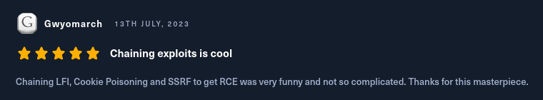
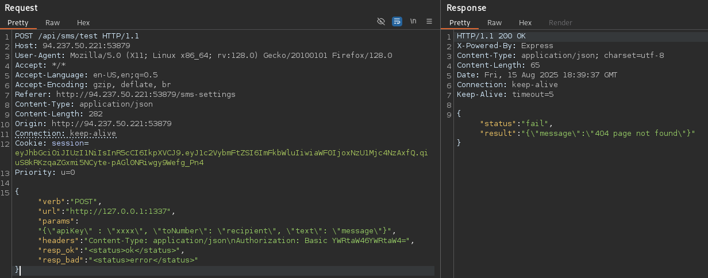

+++
date = '2025-08-16T11:49:44Z'
draft = false
title = 'The Magic Informer'
+++

<!---
[ctf](/tags#ctf) [htb-magic-informer](/tags#htb-magic-informer) [hackthebox](/tags#hackthebox) [lfi](/tags#lfi) [jwt-bypass](/tags#jwt-bypass) [ssrf](/tags#ssrf) [command-injection](/tags#command-injection) [burp](/tags#burp)
--->

The Magic Informer is a HackTheBox challenge featuring a Node.js application with multiple critical vulnerabilities. This writeup demonstrates how I chained LFI, JWT bypass, and SSRF to achieve RCE.

## Box Info

| Name | [The Magic Informer](https://app.hackthebox.com/challenges/The%20Magic%20Informer) |
|------|-----------------------------------------------------------------|
| Type | Challenge |
| Difficulty | <span class="diff-Easy">Easy</span> |
| Creator | [Rayhan0x01](https://app.hackthebox.com/users/60115) & [makelaris](https://app.hackthebox.com/users/107)|
| Release Date | 15 Jun 2023 |

---

## Reconnaissance

### Application Overview
The web application features:
- The landing page of the site
    <p style="text-align: center"></p>
- User registration/login system
    <p style="text-align: center"></p>
- After logging in we see a job application form with file upload 
    <p style="text-align: center"></p>

### Source Code Analysis
Key discoveries from code review:
- **Debug Endpoint with Command Injection**
    ```javascript
    let cmdStr = `sqlite3 -csv admin.db "${safeSql}"`;
    const cmdExec = execSync(cmdStr);
    ```
    <p></p>
- **AdminMiddleware**
``` javascript
import { decode } from "../helpers/JWTHelper.js";

const AdminMiddleware = async (req, res, next) => {
    try{
        if (req.cookies.session === undefined) {
            if(!req.is('application/json')) return res.redirect('/');
            return res.status(401).json({ status: 'unauthorized', message: 'Authentication required!' });
        }
        return decode(req.cookies.session)
            .then(user => {
                req.user = user;
                if (req.user.username !== 'admin') return res.redirect('/dashboard');

                return next();
            })
            .catch(() => {
                res.redirect('/logout');
            });
    } catch(e) {
        console.log(e);
        return res.redirect('/logout');
    }
}

export { AdminMiddleware };
```
- **LocalMiddleware**
``` javascript
const LocalMiddleware = async (req, res, next) => {
    if (req.ip == '127.0.0.1' && req.headers.host == '127.0.0.1:1337') {
        return next();
    }
    return res.status(401).json({ message: 'Blocked: This endpoint is whitelisted to localhost only.' });
}

export { LocalMiddleware };
```


## Exploit Chain

### LFI via Path Traversal
Discovered in the `/download` endpoint, which i got after uploading a resume in the job application form:
```javascript
resume = resume.replaceAll('../', ''); // Incomplete sanitization
```
<p style="text-align: center"></p>

Intercepted the request in burp
<p style="text-align: center"></p>

identified error indecating path of valid file locations
<p style="text-align: center"></p>

tried some lfi payloads, but no luck, kept getting errors
<p style="text-align: center"></p>

Then i checked the route file for this /download endpoint and figured out that the code was replacing all the `../` characters with `‘’`

``` javascript
router.get('/download', AuthMiddleware, async (req, res) => {
    return db.getUser(req.user.username)
        .then(user => {
            if (!user) return res.redirect('/login');

            let { resume } = req.query;

            resume = resume.replaceAll('../', '');

            return res.download(path.join('/app/uploads', resume));
        })
        .catch(e => {
            return res.redirect('/login');
        })
});
```

tried the payload `/download?resume=%2e%2e/%2e/%2e/%2e/etc/passwd` but still it didn't work

lets now check the payloadallthings site for some lfi payloads...

And after multilple trial and error Filter bypass payloads from PayloadAllThings finally worked and sucessfully retreived system files
<p style="text-align: center"></p>
<p style="text-align: center"></p>

After this i felt like a deadend then as i wasn't able to figure out what next then agian i checked the reviews section of this machine and there i saw cookie poisoning
<p style="text-align: center"></p>

### Cookie Poisoning Leading to Privilege Escalation

then i checked the source code for the jwt mechanism and figured out that while decoding token it was not varifying the signature if it is ok or not the authorization checks were happening based on the uername in the token 

``` javascript
import jwt from "jsonwebtoken";
import crypto from "crypto";
const APP_SECRET = crypto.randomBytes(69).toString('hex');

const sign = (data) => {
    data = Object.assign(data);
    return (jwt.sign(data, APP_SECRET, { algorithm:'HS256' }))
}

const decode = async(token) => {
    return (jwt.decode(token));  //-->vulnerable code
}

export { sign, decode };
```

then by intercepting the request i changed the username to `admin` which we previously identified from the `AdminMiddleware` and injected the poisoned token in the session cookie and got redirected to the `/admin` endpoint and successfully escalated the user role to an admin account.

> Browser manipulation worked more reliably than Burp for JWT testing due to header handling differences.


<p style="text-align: center"></p>
<p style="text-align: center"></p>
<p style="text-align: center"></p>

Then landed on this `/sms-setting` page
<p style="text-align: center"></p>

### SSRF
upon intercepting the request i identified that it was calling the `/api/sms/test` endpoint so I then started investigating the route of this path. 
(I am checking it through the provided source code, but it could also be done via the lfi vulnerablity by traversing to the `/app/route/index.js` endpoint.)

``` javascript
router.post('/api/sms/test', AdminMiddleware, async (req, res) => {

    const { verb, url, params, headers, resp_ok, resp_bad } = req.body;

    if (!(verb && url && params && headers && resp_ok && resp_bad)) {
        return res.status(500).send(response('missing required parameters'));
    }

    let parsedHeaders = {};
    try {
        let headersArray = headers.split('\n');
        for(let header of headersArray) {
            if(header.includes(':')) {
                let hkey = header.split(':')[0].trim()
                let hval = header.split(':')[1].trim()
                parsedHeaders[hkey] = hval;
            }
        }
    }
    catch (e) { console.log(e) }

    let options = {
        method: verb.toLowerCase(),
        url: url,
        timeout: 5000,
        headers: parsedHeaders
    };

    if (verb === 'POST') options.data = params;

    axios(options)
        .then(response => {
            if (typeof(response.data) == 'object') {
                response.data = JSON.stringify(response.data);
            }
            return res.json({status: 'success', result: response.data})
        })
        .catch(e => {
            if (e.response) {
                if (typeof(e.response.data) == 'object') {
                    e.response.data = JSON.stringify(e.response.data);
                }
                return res.json({status: 'fail', result: e.response.data})
            }
            else {
                return res.json({status: 'fail', result: 'Address is unreachable'});
            }
        })
});
```
<p style="text-align: center"></p>

then i modified the url to one of the urls mentioned in the LocalMiddleware and got a different error

<p style="text-align: center"></p>

<p style="text-align: center"></p>

Then i change the method from post to get and got a success status
<p style="text-align: center"></p>

Though i wasn't sure what to do with it after that so i explored the application a bit more and identified the sql prompt section
<p style="text-align: center"></p>

Then again got this error
<p style="text-align: center"></p>

tried almost everything to bypass this but no luck.
However we have already bypassed the `localMiddleware` via the `sms-settings` functionality so we can try ssrf via tha functionality by injecting these queries in the parameter.
<p style="text-align: center"></p>

Now we are getting unauthentication error seems like we can bypass it by passing the session cookie.

<p style="text-align: center"></p>
But seems like the error is occuring due to  some other reason my guess is this password which i saw was available in the source code, that mean it could also be retrieved via the LFR vuln (path `/debug.env`)

<p style="text-align: center"></p>

I tried the pass from the code base that didn't worked then grabed the new pass via the LFR 
<p style="text-align: center"></p>

again same :)
Then i reffered some writeups and identified i didn't add the Cookie header before passing the session token (silly mistakes).
<p style="text-align: center"></p>

and here we got a success request

### Path to RCE

Now we will be able to execute commands / perform ssrf

extracted the version of db 

``` sqlite
DB type: sqlite
version 3.35.5
```

<p style="text-align: center"></p>

Dumped `sqlite_master` schema 
<p style="text-align: center"></p>

i checked all the db data but nothing useful then i went for looking ways to break out of the input field so that i could executed direct queries on the system. 

For that the defense mechanism looked something like this( they were converting al `"` to `'`)

``` javascript
try 
{
    let safeSql = String(sql).replaceAll(/"/ig, "'");
    let cmdStr = `sqlite3 -csv admin.db "${safeSql}"`;
    const cmdExec = execSync(cmdStr);
    return res.json({sql, output: cmdExec.toString()});
}
```

I bypassed it by this and executed the `id` command to cross check i exectue multiple command and received the following outputs
<p style="text-align: center"></p>

`whoami` command...
<p style="text-align: center"></p>

then tried the `ls -la` command
<p style="text-align: center"></p>
the output was just the first line of the actual output so to bypass it tried and old technique of base64 encoding the output format and then decoding it 

 payload used `ls -la | base64` -> but still didn't got the entire output 
<p style="text-align: center"></p>

 So then tried this `ls -la | base64 -w0 ` (because in the previous command, new line gets added by default after every 76 chars) and got the full output 
<p style="text-align: center"></p>

then in the root `('/')` directory got this readflag binary and we will receive the flag after executing it 
<p style="text-align: center"></p>

and here we got the flag
<p style="text-align: center"></p>

## Remediation

### Secure File Downloads

``` javascript
const resolvedPath = path.resolve('/app/uploads', resume);
if (!resolvedPath.startsWith('/app/uploads')) {
    throw new Error('Invalid path');
}
```

### JWT Best Practices

``` javascript
jwt.verify(token, SECRET_KEY); // Always verify signatures
```

### SSRF Protection

``` javascript
if (!isAllowedURL(url)) {
    throw new Error('URL not permitted');
}
```

## /exit

Challenge conquered. Another flag captured. systemd service stopped 🚩